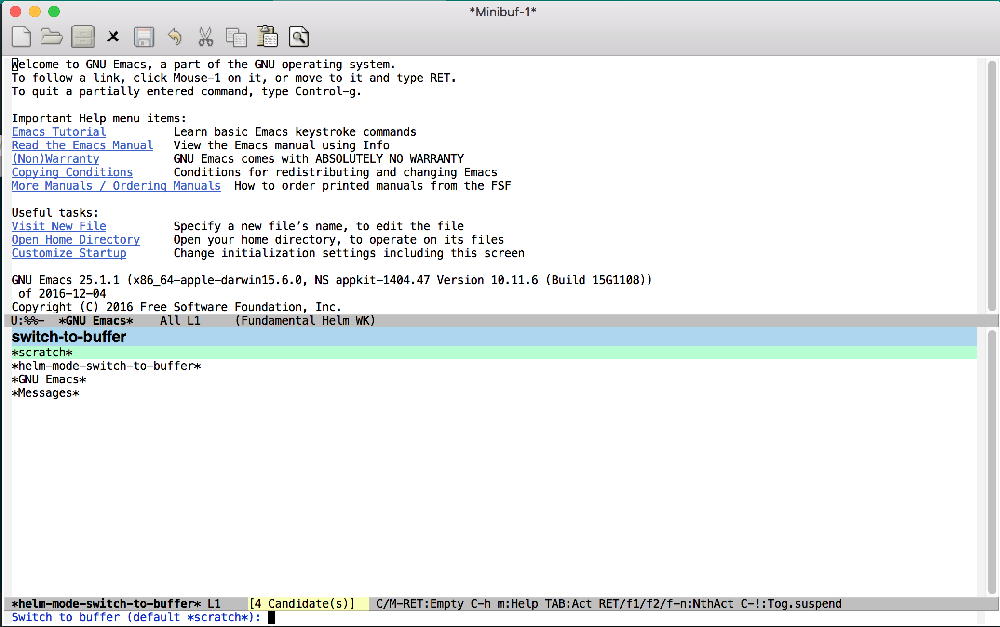
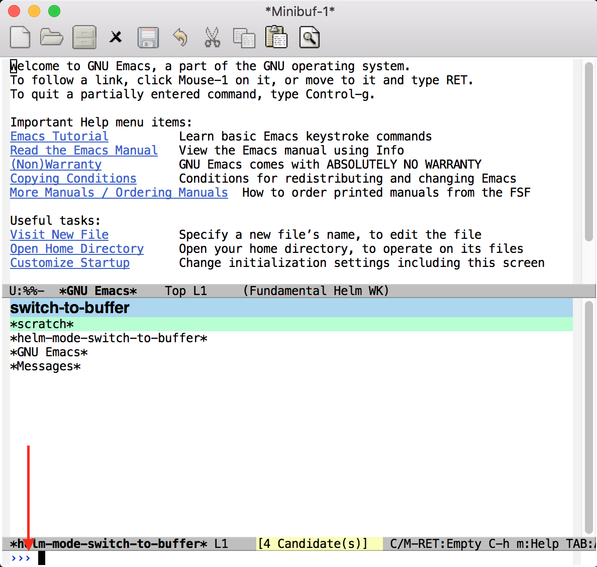
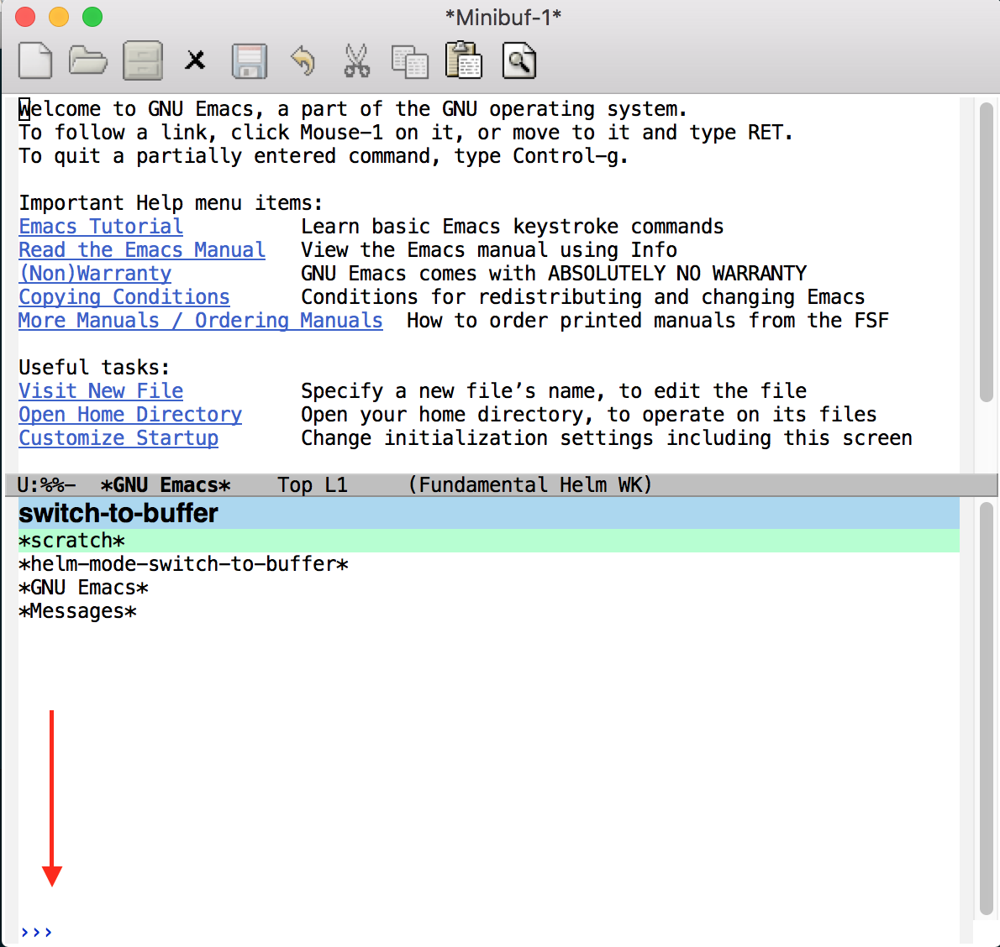

Kong Emacs Configuration

## prereqs

Before using this setup, please make sure you have [cask](http://cask.readthedocs.io/en/latest/) installed.  Further, this setup defaults to use `.zshrc`.  You can see this in the `core-os-osx.el`.  If you have a different config file, like `.bashrc`, or it's located in a different place, you are going to want to update the `core-os-osx.el` file.

Also note that this setup is only optimized for OSX, although I believe that by leaving out some of the items in `init.el`, like the `core-os-osx.el` file you can make it work for most any other OS.


1.  Move into the `.emacs.d` directory
```bash
$ cd ~/.emacs.d
```

2.  Install emacs dependencies with cask
```
$ cask install
```

At this point, this configuration is pretty broken.  Running into a lot of issue when trying to configure helms look and feel.  Otherwise though, the basic flow of the code is working correctly. 

## Not Currently Being Used

- `core/core-buffer-move`

## Helm Configuration:

There are some nice configurations here and I had to reverse engineering what the [doom](https://github.com/hlissner/.emacs.d) setup was doing to make this work, so I am going to break it down a little so other can have an easier time learning and making emacs the way they like.

So this is helm normally, without any UI adjustments:



*above code found in core-heln.el*

What would it look like if we had a different prompt?



*above code found in core-heln.el*

What would it look like if we create a *minor-mode* that hides the mode line when we are using helm?



*above code found in core-heln.el which has dependencies in core-ui-elements.el*

Please note that the reason `kong-hide-mode-line-mode` is set inside of `core-ui-elements` is because it is a minor-mode that can be used throughout Kong.

## TO DO:

Next steps I would like to take with this setup:

### Performance

The more you add, the slower emacs is going to get.  This is true with any program.  However, as I was adding things, I took note of performance.  Here are some modules where, when added, visible performance slow down was seen:

- **core-os-osx.el**: specifically the `exec-path-from-shell` part
